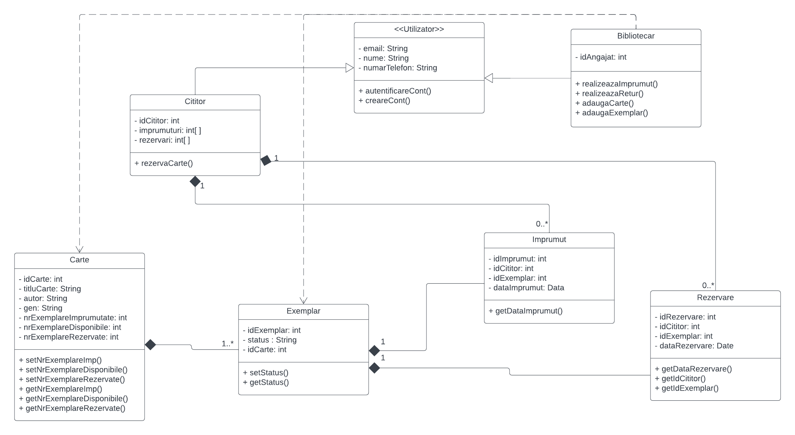

# Titlu proiect: Rezervare si imrpumut carti
### Student(i) Pop Raluca Daniela

## Descriere
Aceata aplicatie reprezinta un sitem de rezervare si imprumut carti de la o biblioteca.

## Arhitectura

## Functionalitati/Exemple utilizare
Exista doua roluri in intermediu aplicatiei: cititor sau bibliotecar.  
Un utilizator cu rol de cititor poate sa verifice daca o anumita carte este disponibila in biblioteca si sa faca o rezervare pentru aceasta. 
Un utilizator cu rol de bibliotecar poate realiza imprumuturi si retunari de carti pentru utilizatorii cu rol de cititor. Acesta poate adauga carti sau exemplare noi in baza de date. 

### Resurse
Markdown Guide, [Online] Available: https://www.markdownguide.org/basic-syntax/ [accesed: Mar 14, 1706]
