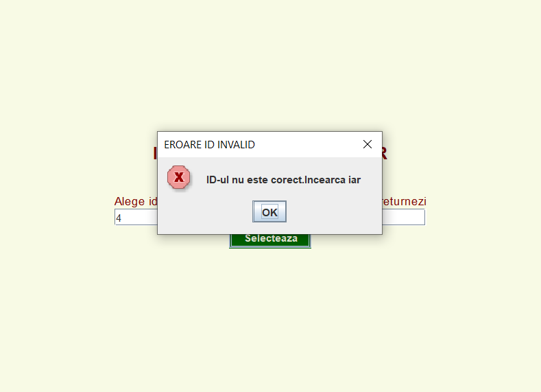

# Titlu proiect: Gestionare biblioteca
### Pop Raluca Daniela

## Descriere
Pentru un utilizator obisnuit aceata aplicatie reprezinta un sitem de rezervare si imprumut carti de la o biblioteca. Dupa ce un utilizator are creat un cont de cititor, acesta poate rezerva un exemplar al cartii dorite, din acel moment, exemplarul respectiv nu va putea fi imprumutat sau rezervat de catre o alta persoana timp de 2 zile, astfel, in acest timp cititorul poate sa mearga la biblioteca si sa imprumute exemplarul respectiv avand siguranta ca acesta este disponibil.
Pentru un utilizator cu rolul de bliotecar, aplicatia are rol administrativ oferind utilizatorului posibilitatea de a creaa conturi de utilizator pentru cititori, de a realiza imprumuturi si retururi, de a adauga exemplare si carti noi in sistem, dar si de a revizui rezervarile facute de catre cititori.
## Motivatie
Aceasta aplicatie vine in ajutorul persoanelor care doresc sa imprumute o anumita carte de la biblioteca, insa inainte de a merge fizic si a imprumuta cartea, acestia pot sa verifice daca exista un exemplar disponibil si sa faca o rezervare pentru acesta.
## Arhitectura

## Functionalitati/Exemple utilizare
*Exista doua roluri in intermediu aplicatiei: cititor sau bibliotecar. 

* Pentru autentificare in cont se verifica credentialele de login, daca acestea nu sunt corecte, atunci utilizatorul va primi un mesaj de eroare.

* Un utilizator cu rol de cititor poate sa verifice daca o anumita carte este disponibila in biblioteca si sa faca o rezervare pentru aceasta. 

* pentru a realiza o rezervare, acesta trebuie sa introduca titlul si autorul cartii pe care doreste sa o rezerve. Daca se gaseste cartea dorita, se va afisa o lista de carti din care trebuie sa aleaga id-ul cartii pe care o doreste. Daca cartea nu este disponibila, sau id-ul cartii este gresit(nu se regaseste in lista de carti afisata anterior) atunci cititorul va primi un mesaj de eroare cerandu-i-se acestuia sa aleaga un alt id.

* De asemenea, un cititor poate sa anuleze o rezervare. Se va afisa o lista cu toate rezervarile pe care acesta le are, si va trebui sa aleaga id-ul exemplarului pentru care doreste sa anuleze rezervarea. Daca id-ul nu este corect, atunci va primi un mesaj de eroare

  

* Un utilizator cu rol de bibliotecar poate realiza imprumuturi si retunari de carti pentru utilizatorii cu rol de cititor. Acesta poate adauga carti sau exemplare noi in baza de date, dar si sa creeze conturi noi de utilizator pentru cititori sau alti bibliotecari

* Dupa intrarea in cont, utilizatorul poate sa aleaga una dintre opiunile de mai jos:

* Adaugare carte noua- daca bibliotecarul alege aceasta optiune, atunci acesta va fi redirectionat catre o alta pagina unde va putea introduce informatii despre noua carte pe care doreste sa o adauge in biblioteca. Pentru aceasta, va trebui sa specifice id-ul cartii, titlu, autorul, genul cartii si numarul de zile pentru care un cititor poate imprumuta cartea. Id-ul cartii trebuie sa fie unic, daca exista deja o carte cu id-ul introdus, atunci se va primi un mesaj aferent.

* Adauga un exemplar in biblioteca- pentru a adauga un nou exemplar in biblioteca, bibliotecarul trebuie sa specifice id-ul cartii aferente. Daca id-ul este gresit(daca nu exista nici o carte cu id-ul specificat), bibliotecarul va primi un mesaj aferet. De asemena, id-urile exemplarelor trebuie sa fie unice, daca se inroduce un id de exemplar care deja exista(apartine altui exemplar), atunci se va afisa un mesaj aferent.

* Creaza un cont de utilizator pentru un cititor. Va trebui sa se introduca CNP-ul cititorului, numele cititorului, numarul de telefon si parola de la cont. Daca CNP-ul nu are lungimea coresounzatoare, sau este deja folosit(exista de un cont de cititor care foloseste acest cnp) se vor afisa mesaje aferente.

* Realizeaza un imprumut -alegand aceasta optiune, un bibliotecar va putea realiza un imprumut pentru un cititor. Acesta va trebui sa specifice titlul si autorul cartii dorite. Apoi, se va afisa o lista de carti, bibliotecarul va trebui sa aleaga din lista id-ul cartii pe care doreste sa o imprumute pentru cititor, si cnp-ul cititorului. Daca id-ul cartii sau cnp-ul cititorului nu sunt valide, atunci se va afisa un mesaj de eroare.

* Realizeaza un retur - alegand aceasta optiune, un bibliotecar poate sa realizeze un retur pentru o carte imprumutata de catre un cititor. Acesta trebuie sa introduca cnp-ul cititorului, daca cnp-ul este incorect(nu exista nu cont asociat acelui cnp), atunci va primi un mesaj de eroare. Se va genere o lista cu toate exemplarele imprumutate de catre cititorul respeciv, iar apoi va trebui sa se aleaga id-ul exemplarului pe are doreset sa il returneze. Daca id-ul este incorect(nu se regaseste in lista de exemplare) atunci se va afisa un mesaj specific.

* Revizuieste rezervarile - alegand aceasta optiune, se vor revizui automat toate rezervarile de carti facute de catre cititori. Daca o rezervare este mai veche de doua zile, atunci aceasta va fi stearsa din lista de rezervari.

* Creaza cont de bibliotecar - alegand aceasta optiune, un bibliotecar poate sa creeze un cont de bibliotecar pentru un nou angajat. Acesta trebuie sa introduca id-ul de angajat al noului bibliotecar, numele acestuia, adresa de e-mail, numarul de telefon si o parola pentru contul acestuia. Cum id-urile sunt unice, daca acesta incearca sa introduca un id care deja exista va primi un mesaj de eroare.

## Tabele baza de data

### Resurse
Markdown Guide, [Online] Available: https://www.markdownguide.org/basic-syntax/ [accesed: Mar 14, 1706]
# proiectP3
